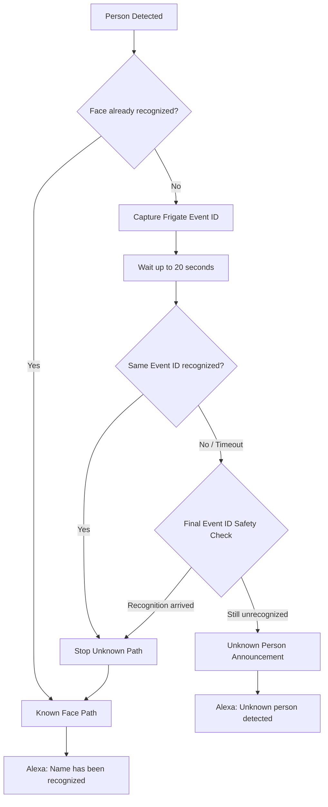
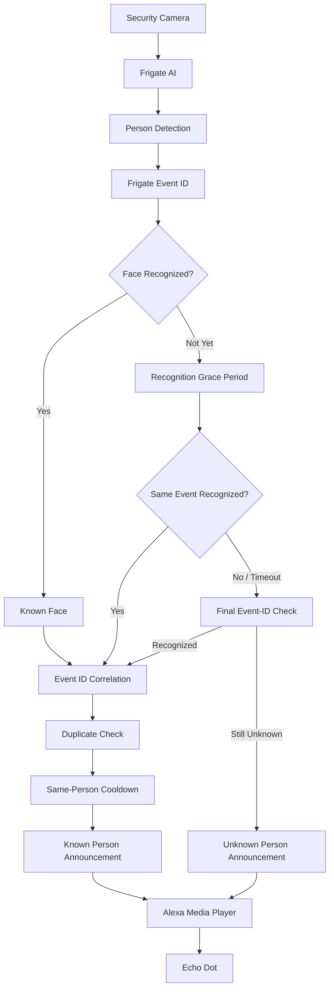

# Alexa Integration

## Overview

The **Makani HomeAuto HomeLab** integrates **Frigate AI**, **Mosquitto MQTT**, **Home Assistant**, **Alexa Media Player**, and an **Amazon Echo Dot** to provide intelligent voice announcements for security-camera events.

The implementation goes beyond a basic:

```text
Person Detected
      ↓
Alexa Announcement
```

Instead, the system understands whether the detected person has been recognized by Frigate and chooses the appropriate announcement.

The final workflow supports:

- Person detection announcements
- Known-person recognition
- Unknown-person warnings
- Recognition confidence
- Camera identification
- Frigate event correlation
- Duplicate-event suppression
- Same-person announcement cooldown
- Delayed face-recognition handling
- Concurrent unknown-person evaluation

The resulting architecture allows Home Assistant to distinguish between:

```text
Person detected
      ≠
Person confirmed unknown
```

This distinction is important because **Frigate object detection and face recognition occur at different stages of the event lifecycle**.

---

# 1. Integration Objective

The objective of the Alexa integration is to convert Frigate security-camera events into meaningful voice notifications inside the home.

For example, when Frigate recognizes a known person:

```text
Camera
   ↓
Person Detected
   ↓
Face Recognition
   ↓
Krishna — 93%
   ↓
Home Assistant
   ↓
Alexa
   ↓
"Krishna has been recognized by the security camera."
```

If Frigate cannot identify the person after the configured recognition period:

```text
Camera
   ↓
Person Detected
   ↓
No Face Identity
   ↓
Recognition Grace Period
   ↓
Still Unknown
   ↓
Home Assistant
   ↓
Alexa
   ↓
"Attention. An unknown person has been detected by the security camera."
```

---

# 2. Architecture

The integration uses the following architecture:


The event flow is:

```text
USB Camera
     │
     ▼
Frigate AI
     │
     ├── Person Detection
     ├── Object Tracking
     ├── Face Recognition
     └── Event ID
     │
     ▼
Mosquitto MQTT
     │
     │ frigate/events
     ▼
Home Assistant
     │
     ├── MQTT Sensors
     ├── Event Correlation
     ├── Known Face Automation
     └── Unknown Person Automation
     │
     ▼
Alexa Media Player
     │
     ▼
Echo Dot
```

---

# 3. Component Responsibilities

| Component | Responsibility |
|---|---|
| USB Camera | Provides the live video stream |
| Frigate AI | Person detection, tracking, face recognition and event IDs |
| Mosquitto MQTT | Transports `frigate/events` MQTT messages |
| Home Assistant | Converts MQTT events into entities and performs event correlation |
| Known Face Automation | Handles recognized-person announcements |
| Unknown Person Automation | Evaluates unrecognized person events |
| Alexa Media Player | Sends announcement commands to Alexa |
| Echo Dot | Plays the security announcement |

---

# 4. Frigate MQTT Event Flow

Frigate publishes object-tracking updates through MQTT.

The primary topic used by this integration is:

```text
frigate/events
```

Important fields within a person event include:

```text
after.label
after.sub_label
after.id
after.camera
after.frame_time
after.start_time
```

For example:

```json
{
  "after": {
    "label": "person",
    "sub_label": ["Krishna", 0.93]
  }
}
```

The `sub_label` values represent:

```text
sub_label[0] = recognized person's name
sub_label[1] = recognition confidence
```

For example:

```text
Name       = Krishna
Confidence = 0.93
```

which represents approximately:

```text
93%
```

---

# 5. Why the Frigate Event ID Matters

One of the most important fields in the integration is:

```text
after.id
```

Frigate assigns an event ID to the tracked object.

For example:

```text
Person detected

Event ID:
ABC123
```

When face recognition later succeeds, another MQTT update may arrive:

```text
Person recognized

Name:
Krishna

Event ID:
ABC123
```

Home Assistant can therefore determine that both messages belong to the **same tracked person**.

Conceptually:

```text
Person Detection
      │
      ├── event_id = ABC123
      │
      ▼
MQTT
      │
      ▼
Home Assistant
      │
      ▼
Wait for Recognition
      │
      ▼
Frigate Recognition
      │
      ├── name = Krishna
      ├── confidence = 93%
      └── event_id = ABC123
      │
      ▼
Event IDs Match
      │
      ▼
Known Person Announcement
```

The fundamental correlation rule is:

```text
recognized_face.event_id == original_person_event_id
```

---

# 6. Home Assistant MQTT Sensors

Home Assistant converts the raw `frigate/events` MQTT stream into useful entities.

These entities provide structured data for automations and troubleshooting.

---

## 6.1 Last Recognized Face

Add the following MQTT sensor under the Home Assistant MQTT configuration:

```yaml
mqtt:

  sensor:

    - name: "Frigate Last Recognized Face"
      unique_id: frigate_last_recognized_face

      state_topic: "frigate/events"

      value_template: >-
        
          {{ value_json.after.sub_label[0] }}
        
          {{ this.state }}
        

      json_attributes_topic: "frigate/events"

      json_attributes_template: >-
        
          {
            "person": "{{ value_json.after.sub_label[0] }}",
            "confidence": {{ value_json.after.sub_label[1] }},
            "camera": "{{ value_json.after.camera }}",
            "event_id": "{{ value_json.after.id }}",
            "frame_time": {{ value_json.after.frame_time }},
            "start_time": {{ value_json.after.start_time }},
            "event_type": "{{ value_json.type }}"
          }
        
          {}
        
```

This creates:

```text
sensor.frigate_last_recognized_face
```

The sensor contains attributes for:

```text
person
confidence
camera
event_id
frame_time
start_time
event_type
```

---

# 7. Face Confidence Sensor

Create another MQTT sensor to convert Frigate's recognition confidence into a percentage.

```yaml
- name: "Frigate Face Confidence"
  unique_id: frigate_face_confidence

  state_topic: "frigate/events"

  unit_of_measurement: "%"

  value_template: >-
    
      {{
        (
          value_json.after.sub_label[1]
          | float * 100
        )
        | round(1)
      }}
    
      {{ this.state }}
    
```

This creates:

```text
sensor.frigate_face_confidence
```

Example:

```text
Krishna
93.0%
```

---

# 8. Face Camera Sensor

The camera responsible for the recognition can also be exposed.

```yaml
- name: "Frigate Face Camera"
  unique_id: frigate_face_camera

  state_topic: "frigate/events"

  value_template: >-
    
      {{ value_json.after.camera }}
    
      {{ this.state }}
    
```

This creates:

```text
sensor.frigate_face_camera
```

This becomes especially useful when the HomeLab expands to multiple cameras.

---

# 9. Face Event ID Sensor

Create an entity containing the current recognized-face Frigate event ID.

```yaml
- name: "Frigate Face Event ID"
  unique_id: frigate_face_event_id

  state_topic: "frigate/events"

  value_template: >-
    
      {{ value_json.after.id }}
    
      {{ this.state }}
    
```

This creates:

```text
sensor.frigate_face_event_id
```

The event ID is essential for correlating face-recognition results with the person event that originally triggered the automation.

---

# 10. Face Recognition Timestamp

The time of the latest recognition can also be exposed.

```yaml
- name: "Frigate Face Timestamp"
  unique_id: frigate_face_timestamp

  state_topic: "frigate/events"

  device_class: timestamp

  value_template: >-
    
      {{ value_json.after.frame_time | timestamp_local }}
    
      {{ this.state }}
    
```

This creates:

```text
sensor.frigate_face_timestamp
```

---

# 11. Automation State Helpers

Several Home Assistant helpers are used to maintain automation state and prevent duplicate announcements.

Add:

```yaml
input_text:

  frigate_last_face_event_id:
    name: Frigate Last Face Event ID
    max: 255

  frigate_last_unknown_event_id:
    name: Frigate Last Unknown Event ID
    max: 255

  frigate_last_announced_face:
    name: Frigate Last Announced Face
    max: 100
```

A timestamp helper is also used:

```yaml
input_datetime:

  frigate_last_face_announcement:
    name: Frigate Last Face Announcement
    has_date: true
    has_time: true
```

---

# 12. Helper Responsibilities

| Helper | Purpose |
|---|---|
| `frigate_last_face_event_id` | Prevent duplicate processing of the same recognized-face event |
| `frigate_last_unknown_event_id` | Prevent multiple unknown-person timers for the same event |
| `frigate_last_announced_face` | Store the most recently announced identity |
| `frigate_last_face_announcement` | Track when the most recent face announcement occurred |

These helpers provide state outside the individual automation execution.

---

# 13. Known Person Recognition Workflow

A recognized-face event must satisfy:

```text
after.label == person
after.sub_label != null
sub_label contains name + confidence
```

The automation extracts:

```text
face_name
confidence
camera
event_id
```

Before announcing the person, Home Assistant checks whether the Frigate event ID has already been processed.

```text
Current Event ID
       │
       ▼
Already Processed?
       │
   ┌───┴───┐
   │       │
  YES      NO
   │       │
   ▼       ▼
 STOP    Continue
```

This is necessary because Frigate may publish several MQTT updates during the lifetime of one tracked person.

---

# 14. Known Person Announcement

After successful event correlation and duplicate checking, Home Assistant sends the announcement through Alexa Media Player.

The resulting workflow is:

```text
Person Detected
      ↓
Frigate Face Recognition
      ↓
Identity Available
      ↓
Event ID Correlated
      ↓
Duplicate Check
      ↓
Cooldown Check
      ↓
Alexa Media Player
      ↓
Echo Dot
```

Example announcement:

```text
Krishna has been recognized by the security camera.
```

The announcement dynamically uses the identity provided by Frigate.

---

# 15. Same-Person Announcement Cooldown

Event-ID deduplication alone is not sufficient.

A person can leave the camera frame and immediately re-enter.

Frigate may then create a new event ID:

```text
ABC123
```

followed shortly by:

```text
XYZ789
```

Both events could belong to the same person.

Without additional protection, Alexa could announce:

```text
Krishna has been recognized.
Krishna has been recognized.
Krishna has been recognized.
```

The implementation therefore checks:

```text
Is this a different person?

OR

Has the cooldown expired?
```

The current cooldown is approximately:

```text
60 seconds
```

Conceptually:

```text
Known Face
    │
    ▼
Same Person as Last Announcement?
    │
 ┌──┴──┐
 │     │
NO    YES
 │     │
 ▼     ▼
Allow  Cooldown Expired?
       │
    ┌──┴──┐
    │     │
   YES    NO
    │     │
    ▼     ▼
  Allow  Suppress
```

---

# 16. Unknown Person Detection

Unknown-person handling operates separately from the known-face automation.

An event initially becomes an unknown-person **candidate** when:

```text
after.label == person
after.id exists
after.sub_label == null
```

However:

```text
sub_label == null
```

does **not** necessarily mean:

```text
Unknown Person
```

It may simply mean:

```text
Face Recognition Has Not Completed Yet
```

This distinction is fundamental to the final design.

---

# 17. Recognition Grace Period

Object detection generally happens before face recognition.

A typical sequence can be:

```text
T+0 sec
Person detected
sub_label = null

T+2 sec
Face becomes visible

T+4 sec
Frigate extracts face

T+5 sec
Recognition completes
sub_label = ["Krishna", 0.93]
```

Therefore Home Assistant must not immediately interpret:

```text
sub_label = null
```

as a confirmed unknown person.

The final implementation uses a recognition window of:

```text
20 seconds
```

---

# 18. Unknown Person Workflow

When a person event initially has no identity:

1. Capture the Frigate `event_id`.
2. Mark the event as being evaluated.
3. Wait for face recognition.
4. Watch the recognized-face sensor.
5. Compare the recognition event ID with the original person event ID.
6. Stop the unknown-person path if recognition succeeds.
7. Perform a final event-ID safety check after the timeout.
8. Announce an unknown person only if the event remains unrecognized.

The complete logic is:



---

# 19. Why Event Correlation Is Required

A simple fixed delay such as:

```yaml
- delay: "00:00:20"
```

is not enough.

Consider two people:

```text
Person A
Event ID = ABC123

Person B
Event ID = XYZ789
```

During Person A's recognition timeout, Person B may enter the camera view and become recognized.

Without event-ID correlation, Home Assistant could incorrectly assume that Person B's recognition belongs to Person A.

The implementation therefore requires:

```text
recognized_face.event_id
        ==
original_person_event_id
```

For example:

```text
Unknown evaluation:
ABC123

Recognition arrives:
XYZ789
```

Result:

```text
NO MATCH
```

The unknown-person evaluation for `ABC123` continues.

But:

```text
Unknown evaluation:
ABC123

Recognition arrives:
ABC123
```

Result:

```text
MATCH
```

The unknown-person path is cancelled.

This becomes increasingly important as more cameras and people are added.

---

# 20. Final Known-Person Behaviour

```text
Person Detected
      ↓
Frigate Recognizes Face
      ↓
Identity + Confidence Available
      ↓
Event ID Correlated
      ↓
Duplicate Check
      ↓
Same-Person Cooldown Check
      ↓
Alexa
      ↓
"Krishna has been recognized by the security camera."
```

---

# 21. Final Unknown-Person Behaviour

```text
Person Detected
      ↓
No Initial Face Identity
      ↓
Capture Event ID
      ↓
Wait Up To 20 Seconds
      ↓
No Matching Recognition
      ↓
Final Event-ID Safety Check
      ↓
Still Unrecognized
      ↓
Alexa
      ↓
"Attention. An unknown person has been detected by the security camera."
```

---

# 22. Delayed Recognition Behaviour

The system also correctly handles delayed face recognition.

```text
Person Detected
      ↓
Initially No Identity
      ↓
Unknown Evaluation Starts
      ↓
Frigate Continues Processing
      ↓
Same Event ID Recognized
      ↓
Unknown Path Stops
      ↓
Known-Face Automation Runs
      ↓
Alexa Announces Identity
```

This prevents an early unknown-person warning followed by a known-person announcement for the same person.

---

# 23. Automation Execution Modes

The known and unknown workflows have different concurrency requirements.

## Known Faces

Recommended/current mode:

```yaml
mode: queued
max: 10
```

This keeps recognized-face events ordered.

---

## Unknown Candidates

Recommended/current mode:

```yaml
mode: parallel
max: 10
```

This allows each person event to independently wait for recognition without blocking another person event.

For example:

```text
Person A ──► Unknown Evaluation ──► Wait
Person B ──► Unknown Evaluation ──► Wait
Person C ──► Unknown Evaluation ──► Wait
```

Each evaluation maintains its own Frigate event ID.

---

# 24. Alexa Media Player Target

The Alexa Media Player integration is used by Home Assistant to deliver the spoken announcement.

The Echo Dot entity currently used by the HomeLab is:

```text
media_player.krishna_s_echo_dot
```

This entity should be available in Home Assistant before the announcement automation is tested.

---

# 25. Validation Checklist

After modifying the integration, validate the complete workflow.

---

## Test 1 — Known Face

Expected:

```text
Person detected
      ↓
Face recognized
      ↓
Alexa announces identity
```

Expected result:

```text
Known announcement = YES
Unknown warning    = NO
```

---

## Test 2 — Unknown Person

Expected:

```text
Person detected
      ↓
No recognition
      ↓
20-second recognition period expires
      ↓
Final safety check
      ↓
Alexa announces unknown person
```

Expected result:

```text
Known announcement = NO
Unknown warning    = YES
```

---

## Test 3 — Delayed Recognition

Expected:

```text
Person detected
      ↓
No immediate identity
      ↓
Recognition takes several seconds
      ↓
Identity arrives inside 20 seconds
      ↓
Alexa announces identity
```

Expected result:

```text
Known announcement = YES
Unknown warning    = NO
```

There should be **no early unknown-person announcement**.

---

## Test 4 — Duplicate Frigate MQTT Updates

Frigate may publish multiple updates for the same event.

Expected:

```text
Event ID = ABC123
      ↓
MQTT Update 1
MQTT Update 2
MQTT Update 3
      ↓
Home Assistant Deduplication
      ↓
One Alexa Announcement
```

Expected result:

```text
Alexa announcements = 1
```

---

## Test 5 — Same Person Repeatedly Visible

Expected:

```text
Krishna detected
      ↓
Alexa announcement
      ↓
Krishna remains/re-enters frame
      ↓
New Frigate activity
      ↓
60-second cooldown
      ↓
Announcement suppressed
```

This prevents announcement spam.

---

## Test 6 — Different Known Person

A different recognized person should not be blocked by the same-person cooldown.

Expected:

```text
Krishna recognized
      ↓
Alexa announcement
      ↓
Different person recognized
      ↓
Announcement allowed immediately
```

---

# 26. Useful Home Assistant Entities

The following entities are useful for monitoring and troubleshooting the integration:

```text
sensor.frigate_last_recognized_face
sensor.frigate_face_confidence
sensor.frigate_face_camera
sensor.frigate_face_event_id
sensor.frigate_face_timestamp

input_text.frigate_last_face_event_id
input_text.frigate_last_unknown_event_id
input_text.frigate_last_announced_face

input_datetime.frigate_last_face_announcement
```

These entities can later be exposed through the Makani HomeAuto monitoring dashboard.

---

# 27. MQTT Validation

If face-recognition entities are not updating, inspect the raw Frigate MQTT stream.

From the Ubuntu Docker host:

```bash
docker exec mqtt mosquitto_sub \
  -h localhost \
  -t 'frigate/events' \
  -v
```

Watch for person events containing:

```text
after.label
after.sub_label
after.id
after.camera
```

For a recognized face, verify that `sub_label` is being populated.

Expected conceptually:

```json
{
  "after": {
    "label": "person",
    "id": "ABC123",
    "camera": "front_camera",
    "sub_label": ["Krishna", 0.93]
  }
}
```

---

# 28. Alexa Validation

If MQTT and Home Assistant are working but no voice announcement occurs:

1. Open Home Assistant.
2. Verify Alexa Media Player is loaded.
3. Confirm the Echo Dot entity exists.
4. Verify the target entity is available.

Current target:

```text
media_player.krishna_s_echo_dot
```

The troubleshooting sequence should be:

```text
Frigate Event
     │
     ▼
MQTT Event Present?
     │
     ▼
HA Sensor Updated?
     │
     ▼
Automation Triggered?
     │
     ▼
Alexa Media Player Available?
     │
     ▼
Echo Dot Available?
     │
     ▼
Announcement
```

---

# 29. Backup Before Configuration Changes

Before making additional changes to the Home Assistant face-recognition or Alexa automation configuration, back up the working files.

From the Ubuntu Docker host:

```bash
cd ~/docker/homeassistant/config
```

Create backups:

```bash
cp configuration.yaml \
   configuration.yaml.face-recognition-backup

cp automations.yaml \
   automations.yaml.face-recognition-backup
```

A timestamped backup is preferable:

```bash
cd ~/docker/homeassistant/config

cp configuration.yaml \
   "configuration.yaml.$(date +%Y%m%d-%H%M%S).bak"

cp automations.yaml \
   "automations.yaml.$(date +%Y%m%d-%H%M%S).bak"
```

Verify:

```bash
ls -lh *.bak
```

---

# 30. Current Implementation State

At the completion of this implementation phase:

- Frigate person detection is operational.
- Frigate face-recognition metadata is consumed through MQTT.
- Home Assistant exposes recognized identity information.
- Recognition confidence is available.
- Camera information is available.
- Frigate event IDs are available.
- Recognition timestamps are available.
- Alexa can announce recognized identities.
- Alexa can announce genuinely unknown people.
- Unknown-person announcements wait for face recognition.
- Recognition is correlated to the exact Frigate event ID.
- Duplicate MQTT events are suppressed.
- Same-person announcements are rate-limited.
- Multiple unknown-person evaluations can run independently.

The resulting workflow is:

```text
Camera
   ↓
Frigate
   ↓
Person Detection
   ↓
Face Recognition
   ↓
MQTT
   ↓
Home Assistant
   ↓
Event Correlation
   ↓
Known / Unknown Decision
   ↓
Alexa Media Player
   ↓
Echo Dot
```

The key engineering principle is:

```text
Person Detected
      ≠
Person Confirmed Unknown
```

---

# 31. Future Improvements

Potential improvements to the Alexa and face-recognition integration include:

1. Add a dashboard card showing the latest recognized identity.
2. Display face-recognition confidence on the HomeLab dashboard.
3. Display the latest Frigate face snapshot beside the identity.
4. Use different Alexa announcements based on camera or location.
5. Add quiet-hours handling.
6. Add confidence thresholds before announcing an identity.
7. Send Home Assistant mobile notifications with snapshots for unknown people.
8. Store recognition events for historical analysis.
9. Extend event correlation across additional cameras.
10. Add MQTT and automation health monitoring to the HomeLab monitoring dashboard.

---

# 32. Final Architecture

The completed Alexa security-announcement workflow can be summarized as:



This architecture allows the HomeLab to turn raw camera detections into **event-correlated, identity-aware voice notifications** while reducing false unknown-person alerts and repeated announcements.