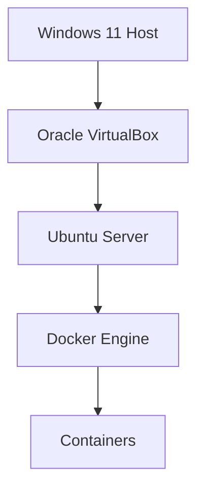
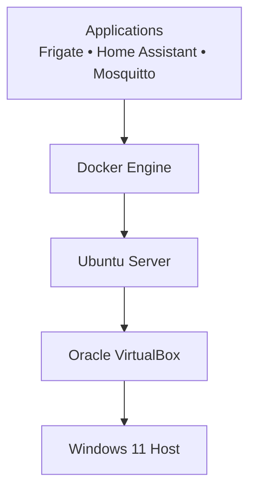

# 💻 Part II — Platform

# Chapter 2

# Ubuntu Server

## *Building the Platform Foundation*

---

> *"A strong platform is invisible. When engineered correctly, it quietly enables everything built on top of it."*

---

:::info 📖 Chapter Information

| | |
|:--|:--|
| **Part** | II — Platform |
| **Chapter** | 2 |
| **Reading Time** | 20 Minutes |
| **Difficulty** | ⭐ Beginner |
| **Status** | 🟢 Verified |
| **Playbook Version** | v0.2.0 |

:::

---

:::info 🧪 Lab Snapshot

| Component | Value |
|-----------|-------|
| Host Machine | Windows 11 Pro |
| Virtualization | Oracle VirtualBox |
| Guest Operating System | Ubuntu Server 24.04 LTS |
| Hostname | Ubuntu-Frigate |
| CPU | 4 vCPUs |
| Memory | 8 GB |
| Storage | 50 GB SSD |
| Docker | Not Installed Yet |
| Current Stage | Platform Foundation |

:::

---

:::tip 🎯 Lab Objectives

By the end of this chapter you will be able to:

- Explain why Ubuntu Server was selected.
- Understand the role of the operating system in the platform.
- Install Ubuntu Server.
- Configure networking.
- Enable SSH.
- Prepare the operating system for Docker.
- Verify the health of the platform.

:::

---

:::note 📦 Prerequisites

Before beginning this chapter ensure you have:

- Windows 11 computer
- Oracle VirtualBox installed
- Ubuntu Server 24.04 LTS ISO
- Internet connection
- Administrator privileges

Estimated Completion Time

**30–45 Minutes**

:::

---

:::info 📚 Knowledge Level

Recommended familiarity:

- Basic computer usage
- Basic networking concepts

No previous Linux experience is required.

:::

---

# 🏗 Platform Preview



---

# 🗺 Chapter Roadmap

1. What is Ubuntu Server?
2. Why Ubuntu?
3. Platform Design
4. Virtual Machine Planning
5. Installation
6. Initial Configuration
7. Verification
8. Troubleshooting
9. Architecture Decision Record
10. Design Review
11. Engineering Journal

---

# What is Ubuntu Server?

Ubuntu Server is a Linux operating system designed specifically for servers, cloud infrastructure and enterprise workloads.

Unlike Ubuntu Desktop, it focuses on stability, reliability and efficient resource usage rather than providing a graphical desktop environment.

Within the Makani Home Lab, Ubuntu Server acts as the foundation on which every other technology is built.

Its primary responsibility is to provide a secure, stable and lightweight platform capable of hosting Docker containers and the services that power the Smart Home Lab.

---

# Where Ubuntu Fits



---

# Why Ubuntu?

Selecting an operating system is one of the first architectural decisions in any infrastructure project.

The operating system influences stability, package availability, security updates and long-term maintainability.

For this project several Linux distributions were evaluated.

| Distribution | Advantages | Trade-offs |
|--------------|------------|-----------|
| Ubuntu Server | Large community, Docker support, Long Term Support | Slightly larger footprint |
| Debian | Extremely stable | Older package versions |
| Fedora Server | Latest software | Shorter support lifecycle |
| Alpine Linux | Minimal resource usage | Better suited for containers than hosts |

After evaluating these options, Ubuntu Server 24.04 LTS was selected because it provides the best balance between stability, documentation, community support and Docker compatibility.

---

:::tip 💡 Engineering Insight

Choosing an operating system is not about selecting the smallest or newest distribution.

It is about selecting the platform that minimizes operational risk while maximizing maintainability.

:::

---

# Why Ubuntu Server Instead of Ubuntu Desktop?

Although both editions share the same Linux kernel, they are designed for different purposes.

| Ubuntu Desktop | Ubuntu Server |
|----------------|---------------|
| Graphical interface | Command-line interface |
| Desktop applications | Server applications |
| Higher memory usage | Lower memory usage |
| End-user productivity | Infrastructure workloads |

Since all applications in this Home Lab will run inside Docker containers, a graphical desktop environment would only consume additional resources.

---

# Design Objectives

The host operating system should remain simple.

Its responsibilities are limited to:

- Running Docker
- Managing storage
- Managing networking
- Providing secure remote administration
- Hosting containers

Applications should **never** be installed directly on the host unless absolutely necessary.

---

# Virtual Machine Design

The Ubuntu virtual machine was designed to provide sufficient resources for current services while leaving room for future expansion.

| Component | Configuration |
|-----------|--------------:|
| Virtual CPUs | 4 |
| Memory | 8 GB |
| Storage | 50 GB SSD |
| Network | Bridged Adapter |
| Guest OS | Ubuntu Server 24.04 LTS |

This configuration comfortably supports Portainer, Dozzle, Mosquitto and future deployments of Frigate and Home Assistant.

---

# Why a Virtual Machine?

Several deployment approaches were considered.

| Platform | Advantages | Trade-offs |
|----------|------------|-----------|
| VirtualBox | Easy to learn, snapshots, portable | Slight performance overhead |
| Bare Metal | Maximum performance | Reduced flexibility |
| Proxmox VE | Enterprise virtualization | Higher learning curve |

The project begins with VirtualBox because it provides a safe environment for experimentation while preserving a clear migration path to Proxmox in the future.

---

# Installation

The Ubuntu Server installation followed these steps:

1. Download Ubuntu Server 24.04 LTS.
2. Create a VirtualBox virtual machine.
3. Allocate CPU, memory and storage.
4. Attach the ISO image.
5. Install Ubuntu Server.
6. Enable OpenSSH during installation.
7. Create the primary administrator account.
8. Complete the installation and reboot.

---

# Initial Configuration

After installation the following tasks were completed.

Update package repositories.

```bash
sudo apt update
sudo apt upgrade -y
```

Verify hostname.

```bash
hostnamectl
```

Check IP configuration.

```bash
ip addr
```

Verify Internet connectivity.

```bash
ping -c 4 google.com
```

---

# Verification Checklist

| Validation | Status |
|------------|--------|
| Ubuntu boots successfully | ✅ |
| Network connectivity available | ✅ |
| Internet access working | ✅ |
| SSH enabled | ✅ |
| Package updates completed | ✅ |
| System ready for Docker | ✅ |

---

# Troubleshooting

## No Internet Connectivity

Verify:

- VirtualBox adapter mode
- Bridged adapter configuration
- IP address
- Default gateway

---

## SSH Connection Refused

Verify:

```bash
sudo systemctl status ssh
```

Enable SSH if necessary.

```bash
sudo systemctl enable ssh
sudo systemctl start ssh
```

---

## Unable to Resolve Hostnames

Verify DNS configuration.

```bash
cat /etc/resolv.conf
```

---

# ADR-001

## Select Ubuntu Server 24.04 LTS

**Status**

Accepted

### Context

A stable operating system is required to host Docker workloads for the Smart Home Lab.

### Options Considered

- Ubuntu Server
- Debian
- Fedora Server

### Decision

Ubuntu Server 24.04 LTS

### Rationale

- Long Term Support
- Extensive community
- Excellent Docker compatibility
- Enterprise adoption
- Predictable release cadence

### Consequences

**Positive**

- Stable platform
- Extensive documentation
- Long support lifecycle

**Trade-offs**

- Slightly larger footprint than minimal distributions

---

# 📊 Design Review

| Category | Rating |
|-----------|:------:|
| Simplicity | ⭐⭐⭐⭐⭐ |
| Stability | ⭐⭐⭐⭐⭐ |
| Maintainability | ⭐⭐⭐⭐⭐ |
| Performance | ⭐⭐⭐⭐☆ |
| Scalability | ⭐⭐⭐⭐☆ |
| Documentation | ⭐⭐⭐⭐⭐ |

---

# 📝 Engineering Journal

### What went well?

- Ubuntu installation completed without issues.
- SSH enabled remote administration immediately.
- Network configuration worked as expected.

### What surprised us?

The minimal Ubuntu Server installation consumed significantly fewer resources than anticipated while providing everything required for infrastructure workloads.

### What would we improve?

Future deployments will standardize host naming conventions and network planning before installation begins.

---

# 🎯 Key Takeaways

- Ubuntu Server forms the foundation of the entire Home Lab.
- The host operating system should remain clean and focused.
- Docker applications belong inside containers, not on the host.
- Good platform engineering simplifies every future deployment.

---

:::note 🚀 Continue Reading

The next chapter explores **Virtual Machine Design**, where we examine CPU sizing, memory allocation, storage planning, networking choices and the reasoning behind the VirtualBox configuration used in this project.

**➡ Next Chapter: Virtual Machine Design**

:::