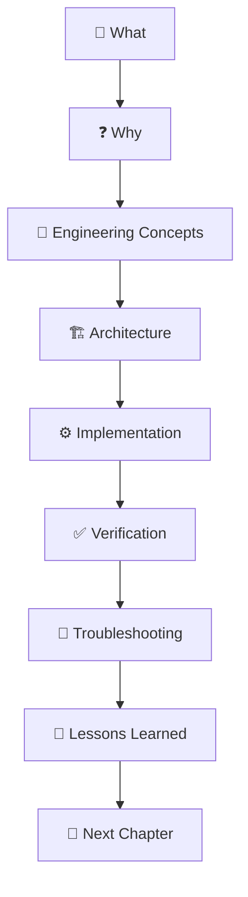

# 📘 Part I — Engineering Foundation

# Chapter 1

# Vision

## *Building an Enterprise Smart Home from First Principles*

---

> *"Don't just build infrastructure. Engineer it, understand it, document it, and continuously improve it."*

---

:::info 📖 Chapter Information

| | |
|:--|:--|
| **Part** | I — Engineering Foundation |
| **Chapter** | 1 |
| **Reading Time** | 10 Minutes |
| **Difficulty** | ⭐ Beginner |
| **Status** | 🟢 Verified |
| **Version** | v0.2.0 |
| **Last Updated** | August 2026 |

:::

---

# Welcome

Welcome to the **Makani Home Lab Engineering Playbook**.

This playbook documents the complete engineering journey of designing, building, operating, documenting, and continuously improving an enterprise-inspired Smart Home platform.

Unlike traditional installation guides, this playbook focuses on **engineering thinking**.

Every deployment has a purpose.

Every architectural decision has a reason.

Every configuration has a trade-off.

Every lesson learned becomes part of the documentation.

This playbook captures that journey—from the very first operating system installation to a fully automated AI-powered smart home.

---

# 🎯 Mission

> **To design, build, document, and continuously improve an enterprise-inspired Smart Home platform while teaching the engineering principles, architectural decisions, and operational practices behind every component.**

---

# 🌍 Vision

The objective of this project is **not** to build the biggest Home Lab.

The objective is to build the **best engineered Home Lab**.

One that demonstrates:

- 🏗 Modern Architecture
- 📚 Exceptional Documentation
- ⚙ Infrastructure as Code
- 🔄 Continuous Improvement
- 🔒 Secure by Design
- 📈 Operational Excellence

Every deployment should be:

- Reproducible
- Version Controlled
- Well Documented
- Easy to Maintain
- Easy to Verify
- Easy to Restore

---

# ❓ Why This Playbook Exists

Most Home Lab tutorials answer one question.

> **"How do I install this?"**

This playbook answers six.

| Question | Purpose |
|-----------|---------|
| **What is it?** | Understand the technology. |
| **Why are we using it?** | Understand the design decision. |
| **How does it work?** | Learn the engineering concepts. |
| **How do we implement it?** | Build it correctly. |
| **How do we verify it?** | Prove it works. |
| **How can we improve it?** | Think like an engineer. |

---

:::tip 💡 Engineering Insight

Technology changes.

Engineering principles rarely do.

Understanding *why* is more valuable than memorizing *how*.

:::

---

# 🏗 Project Objectives

## Technical Objectives

Build a production-inspired Smart Home platform using modern open-source technologies.

The platform will include:

- Ubuntu Server
- Docker Engine
- Docker Compose
- Portainer
- Dozzle
- Mosquitto MQTT
- Frigate AI
- Coral TPU
- Home Assistant
- Zigbee2MQTT
- ESPHome
- Matter
- Monitoring
- Security
- Backup & Recovery

---

## Learning Objectives

Develop practical engineering experience with:

- Linux Administration
- Containerization
- Infrastructure Architecture
- Container Networking
- MQTT Messaging
- Smart Home Automation
- Computer Vision
- Artificial Intelligence
- Monitoring
- Security
- Disaster Recovery

---

## Documentation Objectives

Create documentation that teaches readers:

- What was built
- Why it was built
- How it works
- How it was implemented
- How it was verified
- What alternatives were considered
- Lessons learned during implementation

---

# 👥 Who Should Read This?

This playbook is intended for:

- 🏠 Home Lab Enthusiasts
- 🖥 Infrastructure Engineers
- ⚙ DevOps Engineers
- ☁ Cloud Engineers
- 🎓 Students
- 💡 Technology Enthusiasts
- 📚 Anyone interested in Infrastructure Engineering
- 🔮 Future maintainers (including future me)

---

# 📦 Project Scope

## ✅ Included

This playbook covers:

- Ubuntu Server
- Docker Engine
- Docker Compose
- Networking
- Storage
- Portainer
- Dozzle
- Mosquitto MQTT
- Frigate AI
- Home Assistant
- Zigbee2MQTT
- ESPHome
- Matter
- Monitoring
- Security
- Backup
- Disaster Recovery
- Architecture
- Documentation

---

## ❌ Out of Scope

The following topics are intentionally excluded from Version 1.0.

- Enterprise Identity Management
- Multi-site Clustering
- Commercial Cloud Platforms
- Enterprise SLA Design
- Large-scale Kubernetes Deployments

These technologies are outside the current learning objectives.

---

# 🧭 Engineering Philosophy

Every chapter follows the same engineering workflow.

Instead of memorizing commands, readers gradually develop engineering intuition.

---

# 🔄 Engineering Lifecycle

Every milestone in the Home Lab follows the same lifecycle.

This ensures that the platform and the documentation evolve together.

---

# 🏛 Engineering Principles

The Makani Home Lab follows these guiding principles.

| Principle | Description |
|-----------|-------------|
| 🧠 Understand Before Implementing | Learn the reasoning before the commands. |
| 🏗 Architecture First | Every deployment begins with a design. |
| 📖 Documentation as Code | Documentation evolves with the platform. |
| 🔄 Continuous Improvement | Every milestone leaves the project better than before. |
| 🔍 Verify Everything | Never assume success—validate it. |
| 🔒 Production Mindset | Treat a Home Lab like production infrastructure. |
| 🤝 Teach Others | Documentation should educate, not just instruct. |

---

# 📈 Definition of Success

The project is successful when:

- ✅ Every deployed service is documented.
- ✅ Every architecture decision has a documented rationale.
- ✅ Every deployment is reproducible from Git.
- ✅ Every chapter includes verification procedures.
- ✅ Every chapter includes troubleshooting guidance.
- ✅ Every milestone has release notes.
- ✅ Every implementation improves both the platform and the playbook.

---

# 🚀 What Makes This Project Different?

Most Home Lab repositories show **what** was built.

This playbook explains:

- Why it was built.
- Why it was designed that way.
- What alternatives were considered.
- What trade-offs were accepted.
- What was learned along the way.

The result is more than a Smart Home platform.

It is an engineering case study.

---

:::note 📖 Continue Reading

The next chapter introduces the documentation philosophy that every chapter in this playbook follows.

**➡ Next Chapter:** Documentation Philosophy

:::